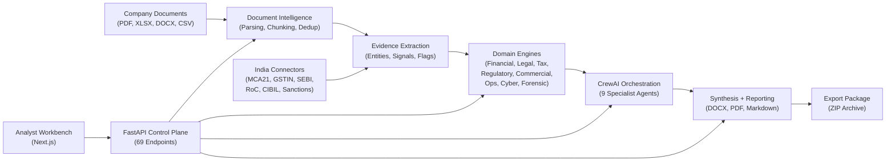
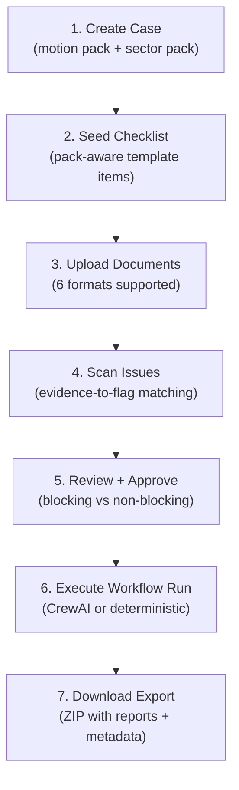
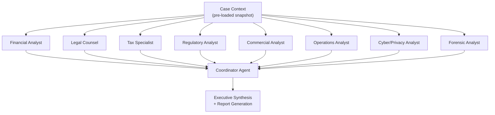
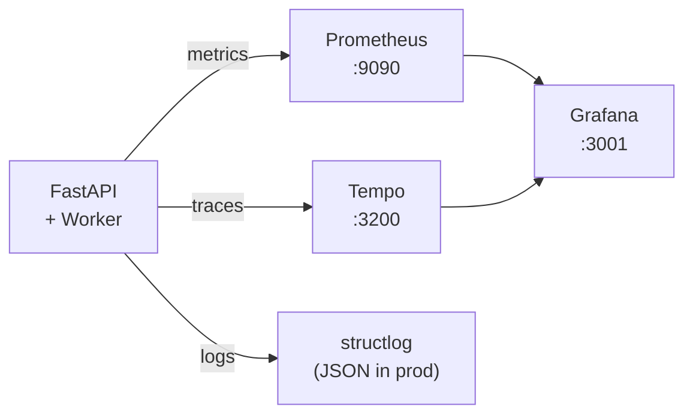
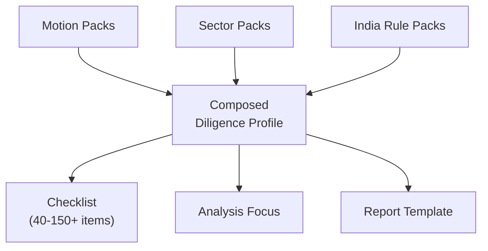

# CrewAI Enterprise Pipeline


A production-grade multi-agent due diligence operating system for the Indian market. Nine domain-expert CrewAI agents orchestrate financial quality-of-earnings analysis, legal and regulatory compliance review, commercial risk assessment, and forensic flag detection across a combinatorial pack model of motion types, sector verticals, and India-specific regulatory rule packs, backed by a FastAPI control plane, a Next.js analyst workbench, and a full observability stack.

## Table of Contents

- [Short Abstract](#short-abstract)
- [Deep Introduction](#deep-introduction)
- [The Entire System Explained](#the-entire-system-explained)
- [Domain Intelligence Engines](#domain-intelligence-engines)
- [The Pack Model](#the-pack-model)
- [India Data Connectors](#india-data-connectors)
- [Quality Validation](#quality-validation)
- [Detailed Deployment Guide](#detailed-deployment-guide)
- [Development Notes](#development-notes)
- [References](#references)

## Short Abstract

This project is an India-focused due diligence operating system. It ingests company documents (financials, contracts, filings, MCA records), extracts structured evidence, runs nine specialized analysis workstreams, and produces traceable diligence reports with checklist coverage, risk flags, and executive memos, all orchestrated through CrewAI multi-agent collaboration or a deterministic fallback when no LLM is configured.

This is not a demo, a template, or a toy. It is a real full-stack system with genuine business logic, tested assertions, and production infrastructure.

At the time of the latest validated audit on **April 8, 2026**, the repository contains:

| System metric | Value |
| --- | ---: |
| Python source files | `102` |
| TypeScript/TSX source files | `17` |
| Python source lines | `29,473` |
| TypeScript source lines | `3,760` |
| Service modules | `39` |
| Domain models and enums | `132` |
| ORM model classes | `19` |
| REST API endpoints | `69` |
| CrewAI agent configurations | `9` |
| Source adapter connectors | `7` |
| Jinja2 report templates | `5` |
| Database migrations | `5` |
| Pytest unit tests | `147` |
| Evaluation scenarios | `31` |
| Evaluation suites | `14` |

All 147 tests pass. All 31 evaluation scenarios pass across 14 suites. Ruff linting and TypeScript type checking are clean.

## Deep Introduction

### What problem this project solves

Due diligence in India is hard.

Not because the analysis itself is mysterious, but because the information landscape is fragmented, jurisdiction-specific, and manually intensive:

- financial statements arrive as multi-sheet XLSX workbooks in INR Crore and Lakh denominations that need normalization before any ratio analysis is meaningful
- legal review requires extracting DIN numbers, parsing RoC charges, identifying shareholding patterns, and cross-referencing MCA21 company master data
- tax compliance spans GST, income tax, TDS, transfer pricing, and deferred tax, each with its own regulatory regime
- regulatory compliance depends on the sector: an NBFC faces RBI capital adequacy requirements that a SaaS company does not, and a manufacturing firm faces factory compliance and EHS rules that neither of them does
- commercial risk assessment needs customer concentration analysis, NRR and churn computation, supplier dependency mapping, and key-person risk identification
- forensic screening requires pattern detection for related-party transactions, round-tripping, revenue anomalies, and litigation exposure
- all of this must be done under time pressure, across multiple workstreams, with traceable evidence, reviewer approvals, and auditable reports

This system automates that entire pipeline.

### What makes this project different from a typical AI demo

Most AI projects in due diligence demonstrate a single capability: "upload a PDF, ask a question, get an answer." This project is different in five structural ways:

1. **It is a complete operating system, not a chatbot.** There are cases, documents, evidence, issues, checklists, approvals, workflows, reports, and exports. The entire diligence lifecycle is modeled and persisted.

2. **It uses a combinatorial pack model.** The system does not hardcode one type of diligence. It composes `motion packs` (buy-side M&A, credit/lending, vendor onboarding) with `sector packs` (Tech/SaaS, Manufacturing, BFSI/NBFC) and `India rule packs` (MCA, GST, SEBI, RBI, DPDP). Every combination produces a different checklist, different analysis focus, and different report template.

3. **It has a deterministic fallback.** When no LLM API key is configured, the system does not break. It runs a complete deterministic analysis pipeline using rule-based extraction, regex pattern matching, and structured heuristics. This means the system is always testable, always deployable, and always produces real output.

4. **It has nine domain-expert agents, not one general-purpose agent.** Each CrewAI agent has a specialized backstory, task definition, and tool set for its workstream: financial, legal, tax, regulatory, commercial, operations, cyber/privacy, forensic, and a coordinator that synthesizes findings across all workstreams.

5. **It is validated by an evaluation harness, not just unit tests.** Beyond 147 pytest tests, the system has 31 named evaluation scenarios across 14 suites that exercise complete end-to-end diligence workflows, including edge cases like adversarial documents, path traversal attempts, and red-team scenarios.

### Who this is for

This system is designed for:

- **M&A advisory teams** running buy-side due diligence on Indian targets
- **Credit and lending teams** evaluating borrower risk for Indian corporates and NBFCs
- **Vendor onboarding teams** performing third-party risk assessments
- **Compliance officers** tracking regulatory obligations across MCA, SEBI, RBI, and DPDP frameworks
- **Internal audit teams** needing traceable, repeatable diligence workflows

### Current validated state

All 19 implementation phases are code-complete. The system has been through a deep audit verifying 130+ masterplan deliverables against actual code. What remains is external: live API credentials, Docker stack validation, production deployment, and UAT with real company documents.

## The Entire System Explained

This section walks through the full system from document upload to final export.

### 1. High-level architecture



The system has three layers:

1. **Data layer** -- Document ingestion, evidence extraction, India connector integration, and structured storage in PostgreSQL with pgvector for hybrid search.

2. **Intelligence layer** -- Eight domain-specific analysis engines plus a CrewAI multi-agent orchestrator that can run all nine workstreams in parallel, coordinated by a synthesis agent.

3. **Product layer** -- A FastAPI API with 69 endpoints, a Next.js analyst workbench, JWT authentication, audit logging, rate limiting, and a full observability stack with Prometheus, Grafana, and Tempo.

### 2. The seven-step data flow

Every diligence case follows the same lifecycle:



Each step is a real API operation backed by persisted state:

- **Step 1** creates a `CaseRecord` with org isolation, motion pack, and sector pack selection
- **Step 2** seeds 40-150+ checklist items from the centralized catalog, scoped to the selected pack combination
- **Step 3** parses documents into chunks (heading > paragraph > sentence splitting, 1200 char max), extracts entities, and deduplicates by SHA256
- **Step 4** runs rule-based issue scanning with word-boundary regex matching against evidence text
- **Step 5** gates the workflow on reviewer approval with `APPROVED`, `REJECTED`, or `CONDITIONALLY_APPROVED` decisions
- **Step 6** runs all domain engines, then either dispatches to CrewAI agents or runs deterministic analysis, producing report bundles and trace events
- **Step 7** packages everything into a ZIP archive with markdown reports, DOCX, PDF, JSON snapshots, and execution traces

### 3. CrewAI multi-agent architecture

When an LLM provider is configured, the system uses CrewAI to orchestrate nine specialist agents:



Each agent has:

- a specialized **backstory** grounded in Indian regulatory context (e.g., the legal counsel knows MCA21, Companies Act 2013, SEBI LODR)
- a dedicated **task** with structured output expectations
- **scoped read-only tools** for evidence search, issue review, and checklist-gap analysis over pre-loaded case snapshots
- **domain-specific tools** (financial ratios, compliance matrix, forensic flags, borrower scorecard, etc.)

The coordinator agent synthesizes findings across all workstreams, identifies cross-cutting risks, and produces the final executive memo.

When no LLM is configured, the deterministic fallback runs the same domain engines and produces the same structured output, just without the LLM-powered synthesis. This is the default safety path (architecture decision AD-001).

### 4. What the analyst sees

The Next.js workbench provides a complete analyst workflow:

| Component | Purpose |
| --- | --- |
| **CreateCaseModal** | Create cases with motion pack, sector pack, and company details |
| **DocumentUpload** | Upload documents with drag-and-drop, format detection, and progress tracking |
| **ChecklistPanel** | View and toggle checklist items with coverage metrics |
| **IssueManager** | Review, edit, and resolve flagged issues with severity controls |
| **ApprovalPanel** | Submit reviewer decisions with comments and conditions |
| **RunWorkflowButton** | Trigger workflow runs with report template selection |
| **LiveRunViewer** | Watch workflow execution in real time via SSE streaming |
| **RequestQaPanel** | Manage information requests and Q&A threads with stakeholders |
| **StatusControlCenter** | Monitor dependency health, LLM provider state, and runtime configuration |

### 5. Security and multi-tenancy

The platform is designed for enterprise deployment:

- **JWT bearer authentication** with configurable expiry and algorithm
- **Organization isolation** via `org_id` on every database table and query filter
- **Role-based access control** with `admin`, `analyst`, `reviewer`, and `viewer` roles
- **Audit logging** with before/after state capture on all mutations
- **Rate limiting** via Redis with deterministic local fallback
- **Dev/test compatibility** with header-based auth bypass for local development

### 6. Observability



The platform exposes:

- **9 Prometheus metric families** covering HTTP traffic, workflow runs, document ingestion, connector fetches, export generation, dependency probes, and LLM usage
- **OpenTelemetry instrumentation** for FastAPI, SQLAlchemy, and HTTPX with OTLP export
- **Structured logging** via `structlog` with request ID, org, actor, route, latency, and status code context
- **Dependency readiness probes** for database, Redis, storage, LLM provider, and all registered source adapters
- **Health endpoints**: `GET /health/liveness` (always alive) and `GET /health/readiness` (deep check of all dependencies)

## Domain Intelligence Engines

The system includes eight specialized analysis engines that operate over document evidence. Each engine extracts structured signals, computes domain-specific metrics, detects risk flags, and auto-satisfies relevant checklist items.

### Financial Quality of Earnings (QoE)

Parses multi-sheet XLSX financial workbooks into annual periods, detects QoE adjustments (one-time costs, restructuring, extraordinary items), computes a normalized EBITDA bridge, and calculates 14 financial ratios:

- Revenue CAGR, EBITDA margins, PAT margins
- Current ratio, quick ratio, debt-to-equity
- Interest coverage, debt/EBITDA
- Working capital days (DIO, DSO, DPO, cash conversion cycle)
- ROA, ROE

Flags: customer concentration >60%, negative operating cash flow, declining revenue growth, Q4 revenue spike, debt/EBITDA >4x.

### Legal, Tax, and Regulatory

- **Legal**: Director and DIN extraction, shareholding patterns, subsidiary mapping, charge/encumbrance detection, 8-type contract clause review (change of control, assignment, termination, indemnity, liability cap, IP assignment, non-compete, confidentiality)
- **Tax**: GSTIN extraction, 5-area compliance assessment (GST, income tax, TDS, transfer pricing, deferred tax), negation-aware statutory signal matching
- **Regulatory**: Sector-aware compliance matrix across 14 common regulatory areas plus sector-specific rules (RBI NPA/CRAR for BFSI, factory/EHS for manufacturing, DPDP 2025 for all)

### Commercial, Operations, Cyber, and Forensic

- **Commercial**: Customer concentration ratios, NRR, churn rate, pricing pressure signals, renewal risk windows
- **Operations**: Supplier concentration, single-site dependency, key-person risk, outsourcing exposure, continuity risk scoring
- **Cyber/Privacy**: DPDP 2025 compliance review, security control posture, certification tracking (ISO 27001, SOC 2), breach history analysis
- **Forensic**: Pattern detection for 4 flag categories: related-party transactions, round-tripping, revenue anomalies, and litigation exposure, each with severity scoring

## The Pack Model

The system uses a combinatorial pack model that composes three dimensions:



### Motion Packs

Each motion pack defines the *type* of diligence engagement:

| Pack | Focus | Key Outputs |
| --- | --- | --- |
| **Buy-Side M&A** | Valuation, SPA risks, PMI planning | Valuation bridge, SPA issue matrix, PMI risk register |
| **Credit / Lending** | Borrower assessment, covenant tracking | Weighted borrower scorecard (AAA-C rating), covenant summary |
| **Vendor Onboarding** | Third-party risk, compliance readiness | Vendor risk tier (L1/L2/L3), certification requirements, review cadence |

### Sector Packs

Each sector pack adds domain-specific metrics and checklist items:

| Pack | Key Metrics | Flags |
| --- | --- | --- |
| **Tech / SaaS** | ARR waterfall, MRR, NRR, churn, LTV, CAC, payback period | Logo churn >10%, NRR <100%, CAC payback >18 months |
| **Manufacturing** | Capacity utilization, DIO/DSO/DPO, asset register (WDV vs replacement) | Single-site dependency, raw material concentration, EHS violations |
| **BFSI / NBFC** | GNPA, NNPA, CRAR, ALM bucket analysis, PSL posture | NPA >5%, CRAR <15%, ALM mismatch, connected lending |

### India Rule Packs

India-specific regulatory knowledge is embedded throughout:

- **MCA21**: Company master data, director DINs, RoC charges, winding-up orders
- **GST**: GSTIN verification, filing history, return compliance
- **SEBI**: SCORES complaints, disclosure obligations, LODR requirements
- **RBI**: Capital adequacy, NPA recognition norms, ALM guidelines (for BFSI)
- **DPDP 2025**: Data protection compliance, consent management, breach notification

### Matrix Coverage

The 3x3 motion-sector matrix produces 9 distinct diligence profiles. Each cell has been validated by dedicated evaluation scenarios:

| | Tech / SaaS | Manufacturing | BFSI / NBFC |
|---|---|---|---|
| **Buy-Side** | SaaS ARR + valuation bridge | Capacity + valuation bridge | NPA/CRAR + valuation bridge |
| **Credit** | SaaS metrics + borrower scorecard | Working capital + borrower scorecard | ALM stress + borrower scorecard |
| **Vendor** | SaaS retention + vendor tier | Ops dependency + vendor tier | Forensic + vendor tier |

## India Data Connectors

The system includes a registered connector framework for India-specific data sources:

| Connector | Data Source | Capabilities |
| --- | --- | --- |
| **MCA21** | Ministry of Corporate Affairs | CIN lookup, director details, charges, filings |
| **GSTIN** | GST Network | GSTIN verification, filing history, return status |
| **SEBI SCORES** | Securities and Exchange Board | Complaints, disclosures, regulatory actions |
| **RoC Filings** | Registrar of Companies | Charges, orders, winding-up petitions |
| **CIBIL** | TransUnion CIBIL | Credit score, account summary, watchouts (stub) |
| **Sanctions** | OFAC + MCA + SEBI lists | Fuzzy name matching against SDN, disqualified directors, debarred entities |

Each connector follows the same lifecycle: `fetch -> parse -> ingest`. Fetched data flows through the same storage, chunking, and evidence pipeline used by document uploads. Connectors operate in stub mode (returning representative sample data) when no real API credentials are configured, and switch to live mode automatically when credentials are present.

## Quality Validation

This project is validated as a real system, not just described conceptually.

### Test coverage

The repository maintains two quality gates:

**147 pytest unit tests** across 24 test files covering:
- Case lifecycle, document parsing, evidence extraction
- Financial QoE computation, legal extraction, tax compliance
- Compliance matrix generation, forensic flag detection
- Motion pack analysis (buy-side, credit, vendor)
- Sector pack analysis (Tech/SaaS, Manufacturing, BFSI/NBFC)
- CrewAI agent wiring, tool attachment, workflow integration
- Enterprise security, observability, production packaging
- Runtime control, dependency probes, LLM catalog

**31 evaluation scenarios** across 14 suites exercising complete end-to-end workflows:

| Suite | Scenarios | What It Tests |
| --- | ---: | --- |
| `buy_side_diligence` | 3 | Blocked, clean, and conditional approval flows |
| `credit_lending_expansion` | 2 | Borrower scorecard, credit checklist |
| `vendor_onboarding_expansion` | 2 | Vendor risk tier, onboarding checklist |
| `manufacturing_industrials_expansion` | 2 | Capacity, working capital, factory compliance |
| `bfsi_nbfc_expansion` | 2 | NPA, CRAR, ALM, RBI compliance |
| `phase8_financial_qoe` | 2 | EBITDA bridge, ratio computation, financial flags |
| `phase9_legal_tax_regulatory` | 3 | DIN extraction, tax compliance, compliance matrix |
| `phase10_commercial_ops_cyber_forensic` | 3 | Concentration, DPDP, forensic flags |
| `phase11_motion_pack_deepening` | 1 | Multi-pack composition |
| `phase12_sector_pack_deepening` | 2 | Sector metric extraction |
| `phase13_rich_reporting` | 2 | DOCX/PDF generation, template variants |
| `phase14_india_connectors` | 2 | Connector fetch, stub-to-live switching |
| `red_team` | 3 | Path traversal, injection, adversarial documents |
| `matrix_coverage` | 8 | All 9 motion x sector cells + report template variants |

### Red-team scenarios

The evaluation suite includes adversarial test cases:

- **Path traversal**: Documents with `../../../etc/passwd` filenames that must be safely rejected
- **Prompt injection**: Documents containing adversarial instructions that must not alter analysis output
- **Adversarial content**: Documents with misleading financial data designed to trigger false positives

### Regression baseline

A committed regression baseline ensures that code changes do not degrade quality. The evaluation runner compares each run against the baseline and fails if any previously passing scenario regresses.

## Detailed Deployment Guide

This project can run in two ways:

1. **Local development** with individual services started from PowerShell scripts
2. **Production deployment** with Docker Compose orchestrating all 10 services

### 1. Prerequisites

#### Required

- Python `3.12` (Conda environment recommended)
- Node.js `20+` for the Next.js workbench
- PostgreSQL `17` (via Docker or local install)
- Redis `7.4` (via Docker or local install)

#### Recommended

- Docker Desktop for the full stack (dev and production)
- MinIO for S3-compatible object storage (document artifacts)

### 2. Environment setup

```powershell
Copy-Item .env.example .env
```

Critical environment variables:

```env
# LLM (optional, enables CrewAI agents)
LLM_PROVIDER=openai
LLM_API_KEY=<your-openrouter-key>
LLM_BASE_URL=https://openrouter.ai/api/v1
LLM_MODEL=openai/gpt-4o-mini

# Database
POSTGRES_PASSWORD=<strong-password>

# Security (production)
JWT_SECRET=<32+-byte-random-string>
ENFORCE_AUTH=true
APP_ENV=production
```

The system works without any LLM configuration. When `LLM_PROVIDER=none` (the default), the deterministic fallback handles all analysis. Adding an LLM key activates CrewAI multi-agent orchestration on top of the same deterministic base.

### 3. Local development

#### Bootstrap

```powershell
./scripts/bootstrap.ps1
```

This creates the Conda environment, installs Python and Node.js dependencies, and prepares the project.

#### Start infrastructure

```powershell
./scripts/dev-stack.ps1
```

Launches PostgreSQL, Redis, MinIO, Prometheus, Grafana, and Tempo via Docker Compose.

#### Start the API

```powershell
./scripts/dev-api.ps1
```

FastAPI server on `http://localhost:8000`. API docs at `http://localhost:8000/docs`.

#### Start the workbench

```powershell
./scripts/dev-web.ps1
```

Next.js workbench on `http://localhost:3000`.

#### Start the background worker

```powershell
./scripts/dev-worker.ps1
```

arq worker for async workflow execution and scheduled dependency probes.

### 4. Production deployment

The production stack runs 10 services:

```powershell
docker compose -f docker-compose.prod.yml up -d
```

| Service | Purpose | Port |
| --- | --- | ---: |
| `postgres` | Primary database | 5432 |
| `redis` | Task queue, rate limiting, caching | 6379 |
| `minio` | Document artifact storage | 9000 |
| `migrate` | Alembic migration runner (exits after completion) | -- |
| `api` | FastAPI control plane | 8000 |
| `worker` | arq background worker | -- |
| `web` | Next.js analyst workbench | 3000 |
| `prometheus` | Metrics collection | 9090 |
| `grafana` | Dashboards and alerting | 3001 |
| `tempo` | Distributed tracing | 3200 |

All services have health checks, memory limits, and named volumes for data persistence.

### 5. Verification

Run the full quality gate:

```powershell
./scripts/check.ps1
```

This runs ruff linting, 147 pytest tests, the evaluation harness, npm lint, TypeScript type checking, a web production build, API reference generation, docker-compose config validation, and a backup dry-run.

Individual commands:

```powershell
# Backend tests and lint
cd apps/api && python -m ruff check src tests && python -m pytest

# Web lint and typecheck
cd apps/web && npm run lint && npm run typecheck

# Evaluation suites
cd apps/api && python -m crewai_enterprise_pipeline_api.evaluation.runner
cd apps/api && python -m crewai_enterprise_pipeline_api.evaluation.runner --suite matrix_coverage

# Live smoke test
./scripts/smoke.ps1

# Production stack validation
./scripts/validate-prod-stack.ps1
```

### 6. Troubleshooting

#### CrewAI agents are not activating

The system defaults to deterministic mode. To activate CrewAI agents, set `LLM_PROVIDER`, `LLM_API_KEY`, `LLM_BASE_URL`, and `LLM_MODEL` in `.env`. Check the workflow run trace: `execution_mode` should show `"crew"` instead of `"deterministic"`.

#### Docker stack is not starting

Ensure Docker Desktop is running. Run `docker compose -f docker-compose.prod.yml config` to validate the compose file. Check individual service logs with `docker compose -f docker-compose.prod.yml logs <service>`.

#### India connectors return stub data

Connectors operate in stub mode by default. To use live data, configure the relevant API credentials (MCA21, GSTIN, etc.) in `.env`. Check connector status at `GET /api/v1/source-adapters`.

#### Financial parsing returns empty results

Ensure uploaded XLSX files have recognizable financial headers (Revenue, EBITDA, PAT, etc.) and period columns (FY2022, FY2023, etc.). The parser supports INR Crore and Lakh denominations and horizontal/vertical grid layouts.

## Development Notes

### 1. Repository structure

```text
apps/
  api/                          FastAPI control plane
    src/crewai_enterprise_pipeline_api/
      agents/                   CrewAI agent configs, tools, and pack crews
        packs/                  Motion-pack-specific crew definitions
      api/routes/               REST endpoint handlers
      core/                     Settings, logging, telemetry, rate limiting, security
      db/                       SQLAlchemy ORM models and session management
      domain/                   Pydantic models and enums (1,168 lines)
      evaluation/               Evaluation harness, scenarios, regression, performance
      ingestion/                Document parser, chunker, financial parser
      services/                 39 service modules (business logic layer)
      source_adapters/          India data connectors (MCA21, GSTIN, SEBI, etc.)
      storage/                  MinIO/local file storage abstraction
      templates/                Jinja2 report templates (5 variants)
    alembic/                    Database migrations (5 versions)
    tests/                      24 test files, 147 tests
  web/                          Next.js 16 analyst workbench
    src/
      app/                      App Router pages
      components/               10 React components
      lib/                      Typed API client (500+ lines)
docs/                           Architecture, decisions, handoff, progress, runbook
scripts/                        12 PowerShell scripts for dev, deploy, and ops
docker-compose.yml              Dev infrastructure stack
docker-compose.prod.yml         Production stack (10 services, 285 lines)
```

### 2. Key conventions

- **ORM models**: `*Record` (e.g., `CaseRecord`, `DocumentArtifactRecord`)
- **Pydantic models**: `*Create`, `*Summary`, `*Detail`, `*Update`, `*Result`
- **Services**: Constructor injection, async/await for all DB/storage I/O
- **Domain models**: All enums and Pydantic models in `domain/models.py`
- **Tests**: SQLite via `aiosqlite` for speed, no external dependencies required
- **Frontend**: CSS modules only (no Tailwind), Next.js 16 App Router

### 3. Architecture decisions

The project tracks architectural decisions in `docs/DECISIONS.md` (68 entries, AD-001 through AD-068). Key decisions include:

| Decision | Summary |
| --- | --- |
| AD-001 | Deterministic fallback is the default safety path when no LLM is configured |
| AD-027 | CrewAI agents use pre-loaded case snapshots, never async database calls |
| AD-030 | Status normalization handles variant LLM output strings |
| AD-068 | Matrix coverage evaluation suite for untested pack combinations |

### 4. Graceful degradation

The system is designed to work progressively:

- **No LLM key**: Full deterministic analysis (default, always works)
- **No embedding key**: Full-text search fallback instead of hybrid semantic search
- **No India connector credentials**: Stub data with representative samples
- **No Docker**: Direct local development with scripts
- **No Redis**: Rate limiting falls back to in-memory counters

### 5. Current known limits

This is a serious production system, but it has honest limits:

- **India connectors are untested against live government APIs** -- All 7 connectors have real parse and ingest logic but have only been tested with stub data. Live government API formats may require adaptation.
- **CrewAI has not been tested with live LLM calls** -- The agent wiring, tool attachment, and deterministic fallback are all verified, but no live LLM run has been executed with real API keys.
- **Docker production stack has not been validated end-to-end** -- `docker-compose.prod.yml` parses and configures correctly, but the full 10-service stack has never been spun up because Docker Desktop was unavailable during development.
- **Evaluation scenarios use fixture-driven assertions** -- The eval harness is comprehensive but assertions are against fixture expectations, not golden-reference outputs from a known-good LLM run.
- **Frontend covers the core analyst workflow** -- 10 components handle the full diligence lifecycle, but dedicated admin screens (audit log viewer, user management UI) are not yet built.

### 6. Internal documentation

For deeper project context beyond this README:

- [`docs/architecture.md`](docs/architecture.md) -- Component inventory and honest current-state assessment
- [`docs/DECISIONS.md`](docs/DECISIONS.md) -- 68 architecture decision records
- [`docs/PROGRESS.md`](docs/PROGRESS.md) -- Phase-by-phase completion history
- [`docs/HANDOFF.md`](docs/HANDOFF.md) -- Session recovery checkpoint
- [`docs/api-reference.md`](docs/api-reference.md) -- Generated API contract from the live FastAPI OpenAPI schema
- [`docs/deployment.md`](docs/deployment.md) -- Production deployment guide
- [`docs/runbook.md`](docs/runbook.md) -- Operations runbook
- [`docs/release-checklist.md`](docs/release-checklist.md) -- Release readiness checklist
- [`docs/EXTERNAL_ACTIONS_CHECKLIST.md`](docs/EXTERNAL_ACTIONS_CHECKLIST.md) -- External actions requiring manual setup
- [`docs/MASTERPLAN.docx`](docs/MASTERPLAN.docx) -- 54-page canonical 18-phase blueprint

## References

### Technology stack

- [FastAPI](https://fastapi.tiangolo.com/) -- Async Python web framework
- [CrewAI](https://docs.crewai.com/) -- Multi-agent orchestration framework
- [Next.js 16](https://nextjs.org/) -- React framework with App Router
- [SQLAlchemy 2.0](https://docs.sqlalchemy.org/) -- Async ORM with PostgreSQL
- [Pydantic 2.11](https://docs.pydantic.dev/) -- Data validation and serialization
- [pgvector](https://github.com/pgvector/pgvector) -- Vector similarity search for PostgreSQL
- [arq](https://arq-docs.helpmanual.io/) -- Async Redis-backed task queue
- [OpenTelemetry](https://opentelemetry.io/) -- Distributed tracing and metrics
- [Prometheus](https://prometheus.io/) -- Metrics collection and alerting
- [Grafana](https://grafana.com/) -- Observability dashboards
- [structlog](https://www.structlog.org/) -- Structured logging
- [Jinja2](https://jinja.palletsprojects.com/) -- Report template engine
- [python-docx](https://python-docx.readthedocs.io/) -- DOCX report generation
- [ReportLab](https://www.reportlab.com/) -- PDF report generation
- [MinIO](https://min.io/) -- S3-compatible object storage
- [Docker Compose](https://docs.docker.com/compose/) -- Container orchestration

### India regulatory references

- [MCA21 Portal](https://www.mca.gov.in/) -- Ministry of Corporate Affairs
- [GST Portal](https://www.gst.gov.in/) -- Goods and Services Tax Network
- [SEBI](https://www.sebi.gov.in/) -- Securities and Exchange Board of India
- [RBI](https://www.rbi.org.in/) -- Reserve Bank of India
- [DPDP Act 2023](https://www.meity.gov.in/data-protection-framework) -- Digital Personal Data Protection

### Project evidence

- Test results: `artifacts/evaluations/` (committed JSON scorecards)
- Regression baseline: `artifacts/evaluations/` (committed baseline file)
- API reference: [`docs/api-reference.md`](docs/api-reference.md) (generated from live schema)
- Architecture decisions: [`docs/DECISIONS.md`](docs/DECISIONS.md) (68 entries)

---

If you are reading this as a builder: the codebase is designed to be understandable, inspectable, and extensible. Every service has real computation, every endpoint returns real computed data, and every test makes meaningful assertions.

If you are reading this as a reviewer: the most important thing to inspect is not whether the output looks plausible, but whether every finding is traceable back to specific document evidence with chunk-level provenance.
